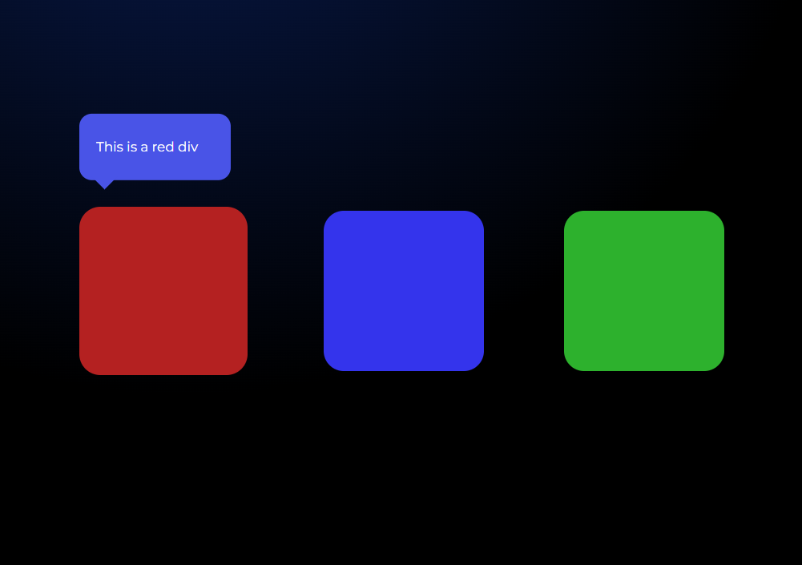
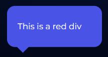
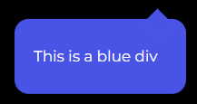
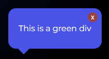

# js-tooltips

A simple and advanced tooltip exercise for junior front-end developers. These tooltips are written in JavaScript, but also use HTML and CSS.

## Photo of the page

## Tooltips variations

| Variation |               top               |                 bottom                |                with close button                |
|:---------:|:-------------------------------:|:-------------------------------------:|:-----------------------------------------------:|
|   Photo   |  |  |  |

> Mentor of this project: [Mate Code](https://github.com/mateocode8933)
